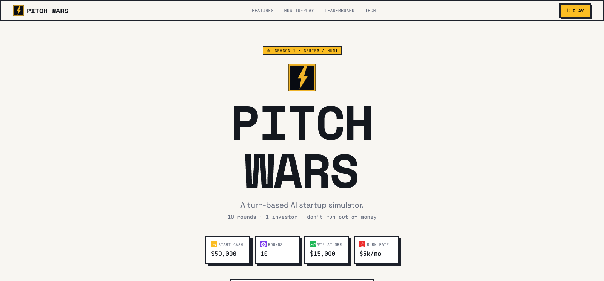

<div align="center">

  

  # Pitch Wars

  **A turn-based AI startup simulator  make decisions, impress your investor, survive 10 rounds.**

  [](https://pitchwars.app)
  [](LICENSE)
  [](https://typescriptlang.org)
  [](https://reactjs.org)
  [](https://vitejs.dev)
  [](https://tailwindcss.com)
  [](https://console.groq.com)

</div>

---

<div align="center">
  
</div>

---

## Overview

Pitch Wars puts you in the hot seat as a startup founder facing a ruthless Silicon Valley seed investor  Victor Chen. Each round, a real market event hits your company, you choose a strategic action, and Victor reacts with AI-powered feedback based on your actual metrics. Unlike static business sims, every response is generated live by `llama-3.3-70b-versatile` via Groq, making each playthrough unique. Win by hitting $15K MRR (acquisition) or surviving all 10 rounds without going bankrupt.

---

## ✨ Features

- 🧠 **AI Investor (Victor Chen)**  Live Groq-powered responses that react to your real metrics every round
- 🎲 **Dynamic Market Events**  8 random events (viral threads, competitor launches, enterprise churn, and more) keep every run different
- 🚀 **4 Strategic Actions**  Ship Feature, Run Marketing, Hire Developer, or Fundraise  each with real trade-offs
- 📊 **Live Metrics Dashboard**  Track Cash, MRR, Users, Burn Rate, Team Size, Product Score, and Investor Trust in real time
- 🏆 **Leaderboard & History**  Cookie-based score tracking persists across sessions with top 10 all-time scores
- 💾 **Auto-Save**  Game state is saved to cookies every round so you never lose progress
- 🤝 **Victor's Advisor Mode**  Unlock AI-recommended actions at round 5 if your investor trust is high enough
- 🔊 **Web Audio Sound Effects**  Procedurally generated audio feedback for actions and events
- 🪪 **Anonymous Identity**  Cookie-based founder name and startup name persist across sessions

---

## 🛠 Tech Stack

| Category | Technology |
|----------|------------|
| Frontend | React 18 + TypeScript + Vite |
| Styling | Tailwind CSS v3 + shadcn/ui (Radix UI) |
| Backend | Vercel API Routes (Node.js) |
| AI | Groq API (`llama-3.3-70b-versatile`) |
| State | React hooks + cookie persistence |
| Testing | Vitest + Testing Library |
| Deployment | Vercel |

---

## 🚀 Quick Start

### Prerequisites

- Node.js 18+
- pnpm (`npm install -g pnpm`)
- Groq API key

### Installation

```bash
# 1. Clone the repo
git clone https://github.com/MuhammadTanveerAbbas/pitch-wars-game.git
cd pitch-wars-game

# 2. Install dependencies
pnpm install

# 3. Set up environment variables
cp .env.example .env.local
# Fill in your values (see Environment Variables section below)

# 4. Run the development server
pnpm dev

# 5. Open in browser
# http://localhost:5173
```

---

## 🔐 Environment Variables

Create a `.env.local` file in the root directory:

```env
# Groq  used server-side in /api/investor-chat
GROQ_API_KEY=your_groq_api_key
```

Get your key: https://console.groq.com

> **Note:** `GROQ_API_KEY` is server-side only. Add it in your Vercel dashboard under Project → Settings → Environment Variables  never expose it client-side.

---

## 📁 Project Structure

```
pitch-wars/
├── api/
│   └── investor-chat.ts     # Vercel API route  calls Groq API as Victor Chen
├── public/                  # Static assets (logo, favicon, manifest)
├── src/
│   ├── components/
│   │   ├── game/            # Game UI (ActionButtons, MetricsDashboard, InvestorChat, etc.)
│   │   └── ui/              # shadcn/ui base components
│   ├── hooks/
│   │   ├── useGameState.ts  # Core game logic + state machine
│   │   └── useSoundEffects.ts
│   ├── lib/
│   │   ├── cookies.ts       # Cookie helpers for save/history/leaderboard
│   │   └── utils.ts
│   ├── pages/
│   │   └── Index.tsx        # Main game page
│   ├── types/
│   │   └── game.ts          # All TypeScript types + game constants
│   └── main.tsx             # App entry point
├── .env.example
├── package.json
└── README.md
```

---

## 📦 Available Scripts

| Command | Description |
|---------|-------------|
| `pnpm dev` | Start development server |
| `pnpm build` | Build for production |
| `pnpm build:dev` | Build in development mode |
| `pnpm preview` | Preview production build |
| `pnpm lint` | Run ESLint |
| `pnpm test` | Run tests (Vitest) |
| `pnpm test:watch` | Run tests in watch mode |

---

## 🌐 Deployment

This project is deployed on **Vercel**.

### Deploy Your Own

[](https://vercel.com/new/clone?repository-url=https://github.com/MuhammadTanveerAbbas/pitch-wars-game)

1. Click the button above
2. Connect your GitHub account
3. Add environment variables in Vercel dashboard
4. Deploy

> Add `GROQ_API_KEY` in Vercel dashboard → Project → Settings → Environment Variables.

---

## 🗺 Roadmap

- [x] 10-round turn-based game loop
- [x] AI investor (Victor Chen) via Groq
- [x] 8 dynamic market events
- [x] Cookie-based save, history & leaderboard
- [x] Advisor mode unlock at round 5
- [x] Web Audio sound effects
- [ ] Multiplayer / async head-to-head mode
- [ ] More investor personas
- [ ] Mobile app version

---

## 🤝 Contributing

Contributions are welcome! Feel free to:

1. Fork the repository
2. Create a feature branch (`git checkout -b feature/amazing-feature`)
3. Commit your changes (`git commit -m 'Add amazing feature'`)
4. Push to the branch (`git push origin feature/amazing-feature`)
5. Open a Pull Request

---

## 📄 License

Distributed under the MIT License. See `LICENSE` for more information.

---

## 👨‍💻 Built by The MVP Guy

<div align="center">

**Muhammad Tanveer Abbas**
SaaS Developer | Building production-ready MVPs in 14–21 days

[](https://themvpguy.vercel.app)
[](https://x.com/themvpguy)
[](https://linkedin.com/in/muhammadtanveerabbas)
[](https://github.com/MuhammadTanveerAbbas)

*If this project helped you, please consider giving it a ⭐*

</div>
